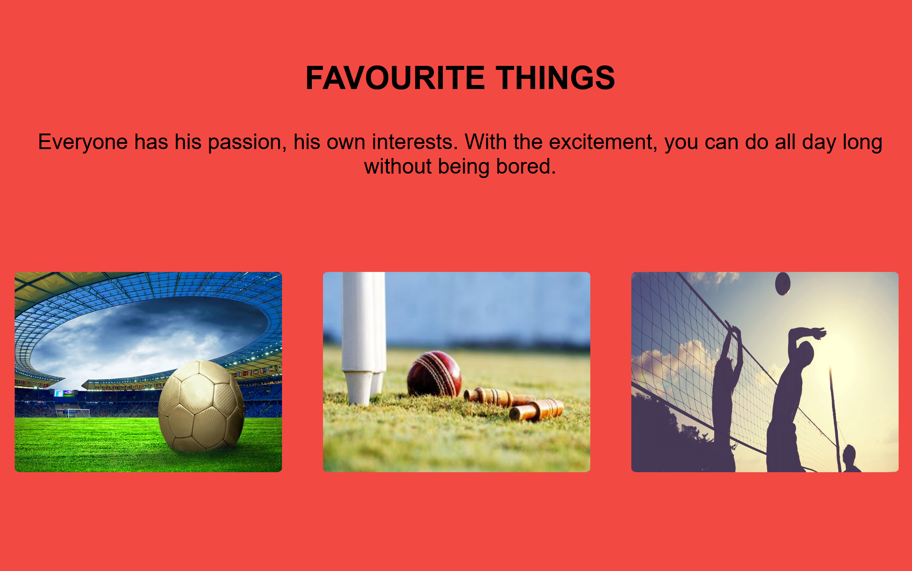

# Modular CSS

> Getting start with Dynamic content and Fetching data from Database
---
### Table of contents

- [Description](#description)
- [References](#references)
- [Author](#author)

---

## Description

This project illustrates 3 favourite things of mine. The main goals behind this project is to make database table with all the information and then fetch that data using PHP and Javascript. However, when user clicks on image, click event sends AJAX request and php get that data back in json format.

[Leaning AJAX](https://docs.google.com/document/d/1RdNh4iCbtOzZASNZpXU6q0sla9PBC0DufmcRBZzn1U4/edit)

### Technologies 
- Git bash
- Visual Studio Code

---

## References
- W3schools
- youtube
- MDN learning

---

## Author

Sarthak Shah

